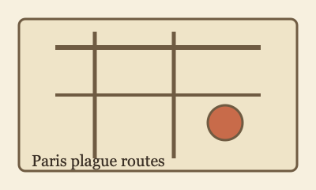

# Assets

Store manuscript images in this directory (or nested subdirectories).

Reference them from manuscript files with Markdown image syntax, for example:

```md

```

Set global image defaults in `stego-project.json`:

```json
{
  "images": {
    "layout": "block",
    "align": "center",
    "width": "50%"
  }
}
```

Use manuscript frontmatter `images` only for per-path overrides:

```yaml
images:
  assets/maps/city-plan.png:
    layout: inline
    align: left
    width: 100%
```
